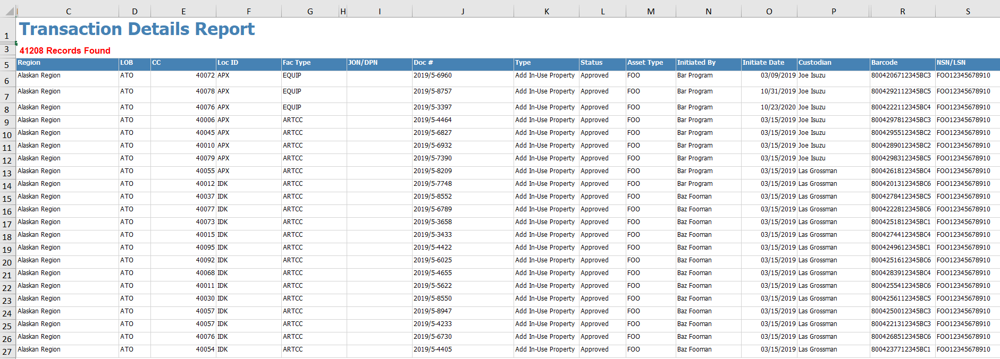
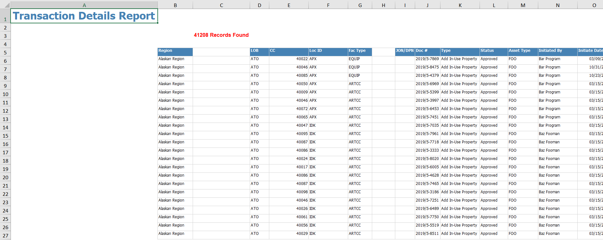

<!-- README.md is generated from README.Rmd. Please edit that file -->

```{r, include = FALSE}
knitr::opts_chunk$set(
  collapse = TRUE,
  comment = "#>",
  fig.path = "man/figures/README-",
  out.width = "100%"
)
```

# excelstrippr    

<!-- badges: start -->
[](https://travis-ci.com/burch-cm/metastrippr)
<!-- badges: end -->

The goal of excelstrippr is to provide an easy way to remove the extraneous
metadata, headers, summaries, etc., and extract the useful tabular data from Excel-based reports. 

## The Problem  
Excel reports often contain titles, data summaries, line counts, empty columns, 
etc., which make importing them into R a troublesome process. 
As there is no universal Excel report format, 
it's difficult to write a reusable script to munge and import the data from 
these reports.

An example Excel report might look like this:  
  

Unhiding hidden elements and adjusting empty columns to make them more clear shows 
that this report isn't in any kind of standard tabular format:  


When this data is imported into R, the results are not useful without serious 
wrangling:  
```{r init-excel}
dat <- readxl::read_excel("./man/example/example-report.xlsx")
head(dat, 10)
```

## The Solution  
excelstrippr will look for the start of a tabular data set in an Excel file, ignoring 
titles, summaries, and other meta-data in the report. 

```{r strip-example}
library(excelstrippr)
dat_stripped <- strip_metadata("./man/example/example-report.xlsx")
head(dat_stripped, 10)
```

The extracted data can then be saved back into another file for future analysis or can be immediately used in analysis pipeline as any other data frame object.

## Installation

You can install the released version of excelstrippr from [CRAN](https://CRAN.R-project.org) with:

``` r
install.packages("excelstrippr")
```

The most recent version of excelstrippr can be installed from [GitHub](https://github.com/burch-cm/excelstrippr) with {devtools}:  
``` r
install.packages("devtools")
devtools::install_github("burch-cm/excelstrippr")
```
