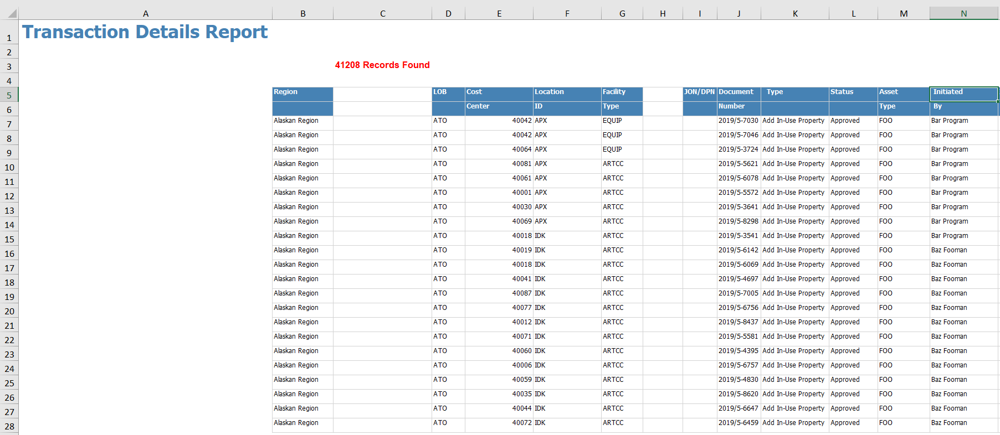

<!-- README.md is generated from README.Rmd. Please edit that file -->

```{r, include = FALSE}
knitr::opts_chunk$set(
  collapse = TRUE,
  comment = "#>",
  fig.path = "man/figures/README-",
  out.width = "100%"
)
```

# excelstrippr      

<!-- badges: start -->
[](https://travis-ci.com/burch-cm/excelstrippr)
[](https://github.com/excelstrippr)
[](https://CRAN.R-project.org/package=excelstrippr)
[](https://codecov.io/gh/burch-cm/excelstrippr?branch=main)
<!-- badges: end -->

The goal of excelstrippr is to provide an easy way to remove the extraneous
metadata, headers, summaries, etc., and extract the useful tabular data from Excel-based reports. 

## The Problem  
Excel reports often contain titles, data summaries, line counts, empty columns, 
etc., which make importing them into R a troublesome process. 
As there is no universal Excel report format, 
it's difficult to write a reusable script to munge and import the data from 
these reports.

An example Excel report might look like this:  
  

Unhiding hidden elements and adjusting empty columns to make them more clear shows 
that this report isn't in any kind of standard tabular format:  


Additionally, some Excel reports have table column names which span multiple rows. This makes them difficult to import into any kind of analysis, including Excel's own pivot tables.  




When this data is imported into R, the results are not useful without serious 
wrangling:  
```{r init-excel}
dat <- readxl::read_excel("./man/example/example-report.xlsx")
head(dat, 6)
```

## The Solution  
excelstrippr will look for the start of a tabular data set in an Excel file, ignoring 
titles, summaries, and other meta-data in the report. 

```{r strip-example}
library(excelstrippr)
dat_stripped <- strip_metadata("./man/example/example-report.xlsx")
head(dat_stripped, 6)
```

Multi-line table headers can be promoted to column names with the "header_nrow" argument.  
```{r multiline-example}
dat_multiline <- 
    strip_metadata("./man/example/example-report-multiline-header.xlsx",
                   header_nrow = 2)
head(dat_multiline, 6)
```

**strip_metadata()** works with both Excel (.xls / .xlsx) and .csv files.  

The extracted data can then be saved back into another file for future analysis or can be immediately used in analysis pipeline as any other data frame object.

## Installation

You can install the released version of excelstrippr from [CRAN](https://CRAN.R-project.org) with:

``` r
install.packages("excelstrippr")
```

The most recent version of excelstrippr can be installed from [GitHub](https://github.com/burch-cm/excelstrippr) with {devtools}:  
``` r
install.packages("devtools")
devtools::install_github("burch-cm/excelstrippr")
```
